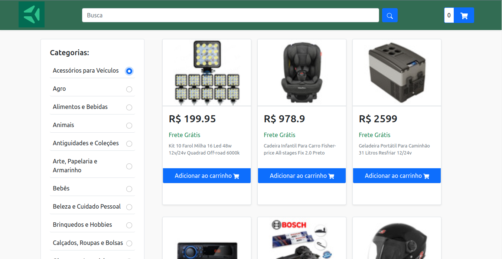

# Projeto Shopping Cart
## 📋 Descrição do projeto
Uma versão simplificada, sem persistência no banco de dados, de uma loja online, desenvolvendo em grupo suas funcionalidades de acordo com demandas definidas em um quadro Kanban, em um cenário mais próximo ao do mercado de trabalho.

## 📷 Screenshot

## 💻 Tecnologias utilizadas
- JavaScript
- React
- React-router
- LocalStorage
- Kanban
- Scrum

## 🎓 Aprendizados
- Buscar produtos por termos e categorias a partir da API do Mercado Livre;
- Interagir com os produtos buscados de modo a adicioná-los e removê-los de um carrinho de compras em diferentes quantidades;
- Visualizar detalhes e avaliações prévias de um produto, bem como criar novas avaliações;
- Entender o que são Métodos Ágeis;
- Entender o que é Kanban;
- Entender o que é Scrum;
- Trabalhar em equipes utilizando Kanban ou Scrum de maneira eficaz;
- Praticar todas as habilidades desenvolvidas até agora no módulo de Front-End;

## 📈 Status do projeto
✅ Concluído

## 🚀 Links
- Site no ar: [Link](https://fronted-online-store-dogl4.vercel.app/)

## :busts_in_silhouette: Contribuintes
<table>

<tr  style="width:120px">

<td  align="center">

<a  target=”_blank”  href="https://github.com/Dogl4">

 

<b>Pedro Barreto</b>

</a>

</td>

</tr>

<tr  style="width:120px">

<td  align="center">

<a  target=”_blank”  href="https://github.com/cifernando">

 

<b>Fernando Oliveira</b>

</a>

</td>

</tr>

<tr  style="width:120px">

<td  align="center">

<a  target=”_blank”  href="https://github.com/marcSeaLow">

 

<b>Marcelo Araujo</b>

</a>

</td>

</tr>

<tr  style="width:120px">

<td  align="center">

<a  target=”_blank”  href="https://github.com/martinsilver">

 

<b>Martin Silva</b>

</a>

</td>

</tr>

<tr  style="width:120px">

<td  align="center">

<a  target=”_blank”  href="https://github.com/victoraster2010">

 

<b>Victor Souza</b>

</a>

</td>

</tr>

</table>

